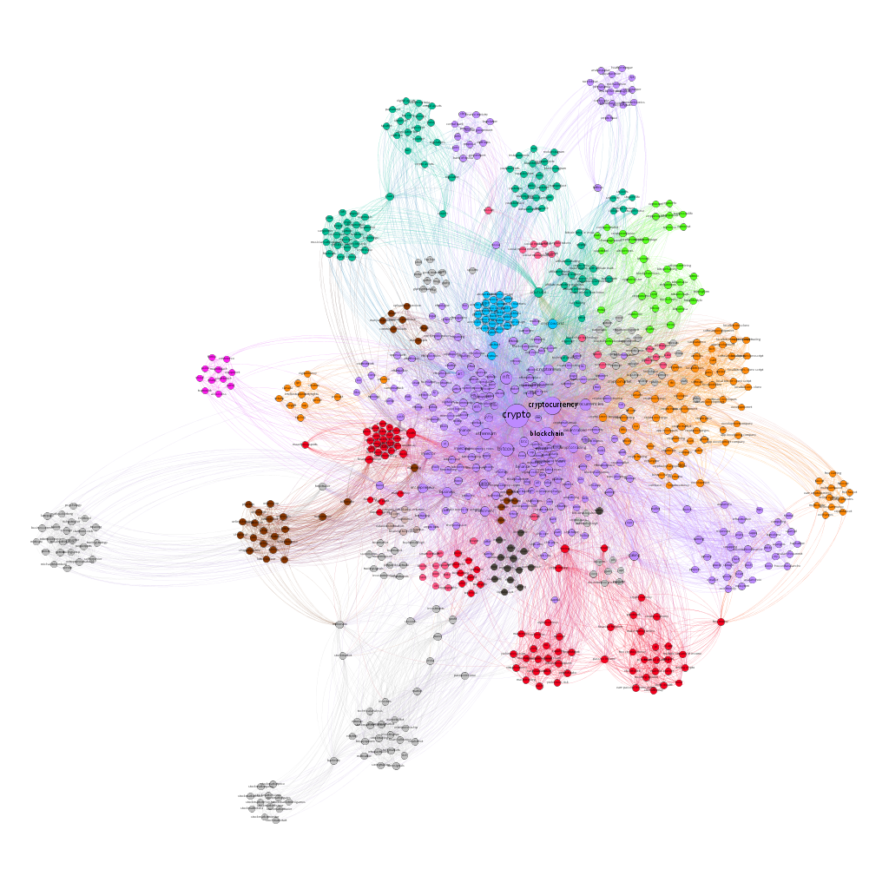

# Social Network Analysis on Crypto from Tumblr Tags
One of the essential features of many web 2.0 services is social tagging , it can be fun ,accurate, flexible, interesting and most importantly utilized for marketing and information organizing purposes. It is how internet users categorize their media and annotate web resources according to their own needs and understanding. For the purposes of this assignment, we are going to extract a co-tag network from the social blogging platform Tumblr , with the word crypto as its central node that every single other node is going to be directly connected to. In particular the nodes are going to be the various tags we found to co-exist with the central one in the 1946 blogs we extracted , and an edge is going to represent the co-existence of two tags in the same blog . The aim of this report is to examine social tags and their co-occurrence relationships within the structure of an information network, using the social network analysis methods to analyze the basic characteristics of said network so can get a better understanding of how information is linked and spread out in the targeted social community of cryptocurrencies . The final and desired goal would be to get a better grasp of what is trending in the very volatile world of cryptocurrencies , discover connections to topics we hadn’t realized exist and perhaps understand where the crypto frenzy is headed.

## Data
To extract the data  we used [Bernhard Reiner's Tumblr Tool](https://labs.polsys.net/) choosing as a central tag-node the word crypto to get a co-tag information network from the last 1946 blog’s from Tumblr (including my central tag) . In the graph_data folder you can find a tabular file containing basic descriptions of the retrieved posts and a co-tag file (GDF format) that was imported to Gephi.

## Analysis
In the report you can find a in-depth analysis on the network , more precisely you can find : 
* Topological Properties
* Component Measures
* Degree Measures
* Centrality Measures
* Clustering Effects of the network
* Bridges and Local Bridges
* Homophily
* Small World Effect
* Graph Density
* Modularity and Cliques
* PageRank

